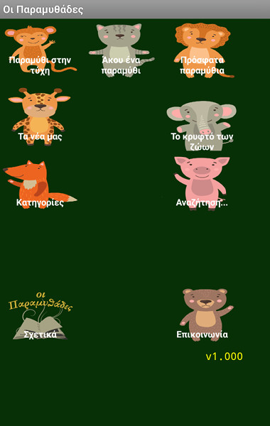
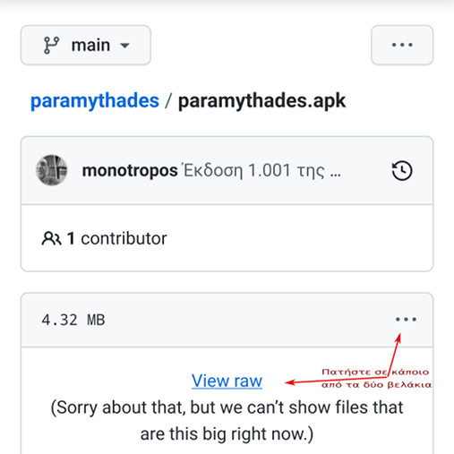
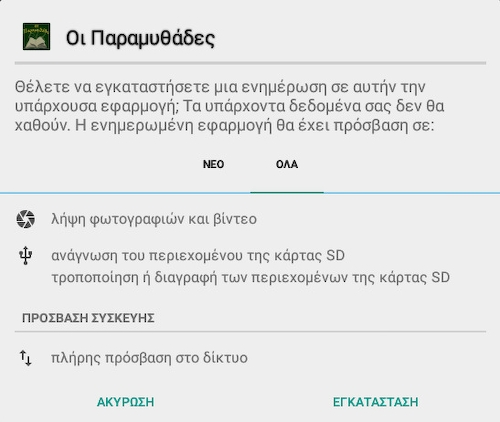

# Οι Παραμυθάδες

Η εφαρμογή της ομάδας των Παραμυθάδων για κινητά τηλέφωνα (και τάμπλετς) με το λειτουργικό σύστημα Android.

| [Χαρακτηριστικά](#χαρακτηριστικά)
| [Προσεχώς](#προσεχώς)
| [Εγκατάσταση/Αναβάθμιση](#εγκατάσταση)
| [Πείτε μας τη γνώμη σας](#πείτε)
|

## Χαρακτηριστικά

- η έκδοση 1.000 της εφαρμογής μας (2022-06-23)
- τα εικονίδια της αρχικής οθόνης συνοδεύονται από τους αντίστοιχους ήχους (2022-05-17)
- ελέγχει αν υπάρχει νεότερη έκδοση της εφαρμογής και καθοδηγεί το χρήστη για να την εγκαταστήσει (2022-05-16)
- ενσωμάτωση αντίστοιχων ήχων στο «Κρυφτό» για κάθε ζευγάρι ζώων (2022-02-26)
- προσθήκη παιχνιδιού «Το κρυφτό των ζώων» και αλλαγή εικονιδίων (στην αρχική οθόνη και στο παιχνίδι) (2022-02-23)
- προσθήκη σελίδας «Άκου ένα παραμύθι» με τυχαία επιλογή παραμυθιού από τα ηχογραφημένα@youtube και αναπαραγωγή του (2022-02-10)
- αντικατάσταση της φόρμας επικοινωνίας με άνοιγμα της εφαρμογής email της συσκευής ώστε ο αποστολέας να έχει τη δυνατότητα αποθήκευσης αντιγράφου του μηνύματος και επισύναψης αρχείου/αρχείων (2022-02-10)
- δυνατότητα κοινοποίησης παραμυθιού μέσω του κινητού/τάμπλετ στις σελίδες «Παραμύθι στην τύχη», «Πρόσφατα παραμύθια» και «Κατηγορίες» (2022-02-06)
- προσθήκη σελίδας για εμφάνιση των κατηγοριών των παραμυθιών με βάση τις λέξεις-κλειδιά (2022-02-05)
- δυνατότητα κοινοποίησης παραμυθιού μέσω του κινητού/τάμπλετ στην οθόνη αναζήτησης (2022-02-05)
- προσθήκη σελίδας για εμφάνιση των τελευταίων 10 παραμυθιών που έχουμε δημοσιοποιήσει (2022-01-31)
- προσθήκη σελίδας για εμφάνιση τυχαίου παραμυθιού για ανάγνωση (2022-01-16)
- προσθήκη εικονιδίων στην αρχική οθόνη (2022-01-14)
- προσθήκη σελίδας αναζήτησης λέξης/φράσης σε όλα τα άρθρα
- προσθήκη σελίδας επικοινωνίας με την ομάδα των Παραμυθάδων
- προσθήκη σελίδας με τα νέα μας
- έναρξη ανάπτυξης της εφαρμογής (2022-01-03)

## Προσεχώς

- προσθήκη σελίδας για αποστολή ζωγραφιάς ως φωτογραφία
- προσθήκη παιχνιδιού «Παραμυθίζω»

## Εγκατάσταση / Αναβάθμιση

- Κατεβάζετε το αρχείο [paramythades.apk](https://github.com/monotropos/paramythades/blob/main/paramythades.apk) στη συσκευή σας, πατώντας είτε στο "**View raw**" ή στις τρεις τελείες και επιλέγοντας "**Download**" και το εκτελείτε.

- Θα σας ζητήσει να ενεργοποιήσετε τη ρύθμιση για εγκατάσταση εφαρμογών από άγνωστες πηγές (εκτός του Play Store δηλαδή), επειδή η εφαρμογή μας δε βρίσκεται στο Play Store. Μετά την εγκατάσταση, απενεργοποιήστε τη ρύθμιση.
- Πρόσθετα δικαιώματα (permissions):
 * Πλήρης πρόσβαση στο διαδίκτυο (λογικό, αφού χρειάζεται να επικοινωνεί με το δικτυακό τόπο των Παραμυθάδων)
 * Χρήση της κάμερας και αποθήκευσης των φωτογραφιών στον αποθηκευτικό χώρο του κινητού ή του τάμπλετ. Θα σας ζητηθεί αν επιλέξετε τη «Ζωγραφιά».

Δείτε τη σχετική οθόνη με τα πρόσθετα δικαιώματα που χρειάζεται η εφαρμογή.

## Πείτε μας τη γνώμη σας

Αν θέλετε να προτείνετε κάποια προσθήκη ή αλλαγή/διόρθωση στην εφαρμογή, γράψτε [εδώ τις προτάσεις σας](https://aptlogs.com/paramythades/mobile_app_poll.php).

> Τελευταία ενημέρωση: 2022-06-24

	vim:ft=markdown:ts=4:

